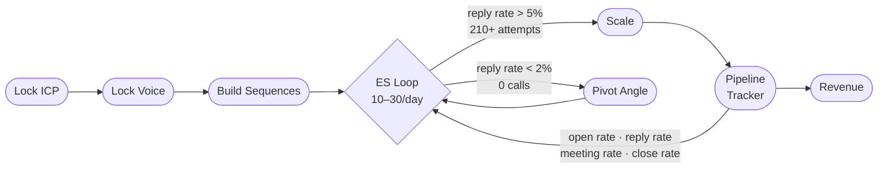

# B2BPraxis

A B2B company growth system for Claude. Guides the full revenue operation from ICP definition to repeatable pipeline — sessions are persistent, state lives in files.



## Install

```bash
curl -o ~/.claude/skills/b2bpraxis.md https://raw.githubusercontent.com/Sebastians007/b2bpraxis/main/skills/b2bpraxis.md
```

## Use

Run `/b2bpraxis` in any company folder. Claude detects whether this is a new operation or an existing one and runs the right flow.

**New company:** Clarity interview → ICP stress test → messaging framework → outreach sequences → 12-week revenue roadmap

**Existing company:** Funnel audit → gap diagnosis → fix the leak → roadmap from current position

## What it does

- Locks ICP before touching any copy
- Builds cold email + LinkedIn + call sequences from your real proof points
- Generates proposal templates that lead with the client's outcome
- Tracks pipeline state across sessions (state lives in files, not Claude's memory)
- Generates a 12-week week-by-week revenue roadmap starting from where you actually are
- Diagnoses the funnel weekly: open rate, reply rate, meeting rate, close rate

## Folder structure (after `/b2bpraxis` runs)

```
your-company/
├── CLAUDE.md              ← always-on session rules
├── GTM.md                 ← ICP, positioning, sales process, objection map
├── PIPELINE_TRACKER.md    ← live pipeline: deals, metrics, weekly diagnosis
├── PROJECT_STATE.md       ← where we left off
├── ROADMAP.md             ← 12-week plan from current position
└── outputs/
    ├── messaging.md       ← hooks, proof points, value propositions
    ├── sequences/
    │   ├── cold-email.md
    │   ├── linkedin.md
    │   └── cold-call.md
    └── proposals/
        └── proposal-template.md
```

## Part of the Praxis family

- **AppPraxis** — full-stack app development (idea → deployed product)
- **SelfPraxis** — freelancer personal brand (audit → client pipeline)
- **B2BPraxis** — company B2B revenue (ICP → repeatable pipeline)
